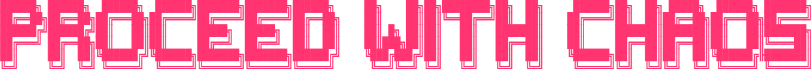

# PROCEED WITH CHAOS



> **Paradox is the source code of reality.**

A collection of 255+ paradoxes exploring philosophical contradictions and psychological truth. Terminal-aesthetic interface built with vanilla JavaScript.

**[→ Live Site: proceedwithchaos.com](https://proceedwithchaos.com)**

---

## 🌀 About

There is infinite wisdom inside of paradox. Logic is key to scientific truths, but reality as a whole is not bound to these confines. Many of life's most profound truths are hidden in-between the lines, obfuscated through paradox, and concealed from the plaintext realities of everyday life.

This project explores 255+ paradoxes organized into 8 categories, presented through a minimalist terminal-inspired interface.

---

## ✨ Features

- **255+ Paradoxes** - Comprehensive collection spanning philosophy, psychology, mathematics, and beyond
- **8 Categories** - Organized streams for different types of paradoxes
- **Terminal UI** - Clean, minimal aesthetic with monospace typography
- **Vanilla JavaScript** - No frameworks, no dependencies, just pure HTML/CSS/JS
- **Fully Responsive** - Works seamlessly across desktop, tablet, and mobile
- **Dark Theme** - Easy on the eyes with pink, green, and yellow accent colors
- **ASCII Art** - Custom visual elements that enhance the terminal experience

---

## 🎨 Design Philosophy

### Less Is More
The site embraces minimalism with:
- JetBrains Mono font throughout
- Terminal-inspired color palette (black, pink, green, yellow)
- No unnecessary animations or effects
- Focus on content over decoration

### Paradox as Interface
The design itself embodies paradoxical thinking:
- Order through chaos (structured randomness)
- Simplicity revealing complexity
- Digital nostalgia (modern terminal aesthetic)

---

## 🛠️ Tech Stack

- **HTML5** - Semantic markup
- **CSS3** - Custom properties, Grid, Flexbox
- **Vanilla JavaScript** - No frameworks or libraries
- **GitHub Pages** - Static hosting
- **Cloudflare** - DNS and SSL

---

## 📂 Project Structure

```
proceedwithchaos/
├── index.html              # Boot sequence / manifesto page
├── main.html               # Main paradox collection interface
├── order.html              # Easter egg "preserve order" page
├── robots.txt              # SEO: Search engine instructions
├── sitemap.xml             # SEO: Site structure for indexing
├── favicon.ico             # Classic favicon
├── favicon-16x16.png       # Small favicon
├── favicon-32x32.png       # Standard favicon
├── apple-touch-icon.png    # iOS home screen icon
└── assets/
    ├── fonts/              # MesloLGS NF font files
    └── images/             # Logos and graphics
```

---

## 🎯 Category Overview

The 255+ paradoxes are organized into 8 streams:

1. **Philosophical Core** - Fundamental contradictions of existence
2. **Mathematical Framework** - Logical inconsistencies in systems
3. **Psychological Truth** - Contradictions in human consciousness
4. **Social Dynamics** - Paradoxes in human interaction
5. **Temporal Reality** - Paradoxes of time and causality
6. **Quantum Existence** - Quantum mechanical paradoxes
7. **Creative Process** - Artistic and creative contradictions
8. **Language & Logic** - Self-referential and semantic paradoxes

---

## 💡 Philosophy

### Why Paradoxes Matter

Paradoxes are the key to psychological truth. When it comes to the human condition, the deepest truths are often counter-intuitive. When you find two opposites that are both true, start exploring. More often than not, you'll discover how two seemingly contradictory statements can align to be equally correct with a combined value that outweighs the sum of its parts.

Examples:
- "Change is the only constant"
- "The more you know, the less you understand"
- "Less is more"
- "Failure is the key to success"

At face value, each statement is counter-intuitive and defies the standards of scientific logic and reason, yet real-life experience ultimately proves to resolve each of these contradictions into truth every time.

---

## 🎨 Color Palette

```css
--black:   #0a0a0a  /* Background */
--white:   #f0f0f0  /* Primary text */
--pink:    #ff3471  /* Accent / Brand */
--yellow:  #ffc41b  /* Highlights */
--green:   #00ff41  /* Success / Active */
--cyan:    #00d4ff  /* Links */
```

---

## 📄 License

**When everyone copyrights, copyleft.**

This project is open source and available under the [MIT License](LICENSE) - meaning you're free to fork, modify, and use it however you want. Just give credit where it's due.

---

## 🙏 Acknowledgments

- **JetBrains Mono** - Beautiful monospace font
- **GitHub Pages** - Free static hosting
- **Cloudflare** - DNS and SSL management
- All the philosophers, mathematicians, and thinkers who've explored paradoxes throughout history

---

## 📬 Contact

**Created by [Chris Vrakas](https://chrisvrakas.com)**

- Website: [chrisvrakas.com](https://chrisvrakas.com)
- GitHub: [@chrisvrakas](https://github.com/chrisvrakas)
- PGP: [freedom@chrisvrakas.com](mailto:freedom@chrisvrakas.com)

---

## ⚡ Fun Facts

- The site contains **zero external dependencies**
- The entire codebase is **vanilla HTML, CSS, and JavaScript**
- The favicon is a custom hexagon design representing **structured chaos**
- The "PRESERVE ORDER" option leads to an Easter egg roast page

---

<div align="center">

**"Learn More. Know Less."**

**[Proceed With Chaos →](https://proceedwithchaos.com)**

</div>
